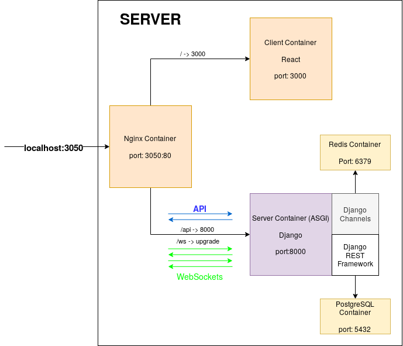

# Yac - Yet Another Chat

 

yac, yet another chat, is a chat application, fast and simple, running on docker containers.

# How to run?

There are three ways to run this proyect:

1. See the proyect running in production in the [following link to AWS](http://yactest-env.eba-pdhg7uqt.us-east-2.elasticbeanstalk.com/)

2. To run it locally, you need to have DOCKER  installed in your machine. After you've installed docker, you need to install ```docker-compose```, you can use 'pip' for this pourpose:
    
    ```pip install docker-compose```

    Then, clone this repo, go to the root directory, and run:

    ```docker-compose up```

    That will create the network between the containers. It won't build any image, all the images are built and published in[docker hub](https://hub.docker.com):

    * [yac-server](https://hub.docker.com/r/edraobdu/yac-server)
    * [yac-client](https://hub.docker.com/r/edraobdu/yac-client)
    * [yac-nginx](https://hub.docker.com/r/edraobdu/yac-nginx)

3. Finally, you can also build the images and run the proyect in a development environment, just run:

    ```docker-compose -f docker-compose-dev.yml up --build```

    This will create the images (not suitables for production) and run the containers network.

# Architecture



### Tecnologies:
- Docker
- Python 3.7
- Django 3
  - Django REST Framework
  - Django Channels
- Postgres
- Redis
- React

In Development, this application runs over 5 docker containers:

- **CLIENT** -> Node container running the React application. The production version of this container uses an Nginx container instead of a node one to serve the 'build' version of the react application

    - PORT: 3000:3000
    - VERIONS: alpine

- **SERVER** -> Python container running the Django proyect. Uses Django Rest framework to built the REST Api, and Django channels to manage the messages sent through WebSockets.

    - PORT: 8000:8000
    - VERSION: 3.7-alpine

- **NGINX** -> Nginx container working as a router, any incomming request that contains a leading '/api' path will be redirected to the SERVER container, otherwise it's sent to the CLIENT container. Also allow us to use websockets inside the network without any special configuration in production.

    - PORT: 3050:80
    - VERSION: 3.7-alpine

- **POSTGRESQL** -> Postgres container to store the data received via the API.

    - PORT: 5432
    - VERSION: 10-latest  

- **REDIS** -> Redis container to serve as a message broker, messages sent and received to and by the server uses a redis channel layer to comunicate.

    - PORT: 6379
    - VERSION: latest

In production, this application is deployed on Amazon Web Services:

- **AWS Elastic Beanstalk** -> This service will containt the three main containers: *nginx*, *client* and *server*.

- **AWS Relational Database Services** -> Service to run the postgres database instance.

- **AWS ElastiCache** -> Service to run the redis instance.


# Inicial Requirements
This are the specified initial requirements to meet with this project

    # yac

    Yet Another Chat

    Must have the following features:
    * login (could be just login by nickname or full signup process your choice)
    * like IRC on one chat room
    * can't be 2 people with same nickname
    * chat room with the whole history
    * an input to type messages
    * message must be appended to the chat of all participants
    * messages must show the sender and time


    ## Front end, use this stack:
    * Javascript:
    * React
    * Redux
    * Sagas
    
    * HTML/CSS material

    ## Backend, use this stack:
    * Applicacion:  
    * Python - Bonus
    * Node
    * firebase or similar